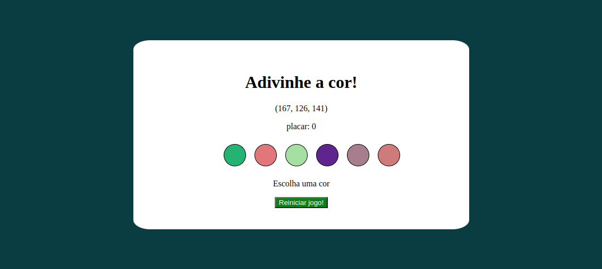
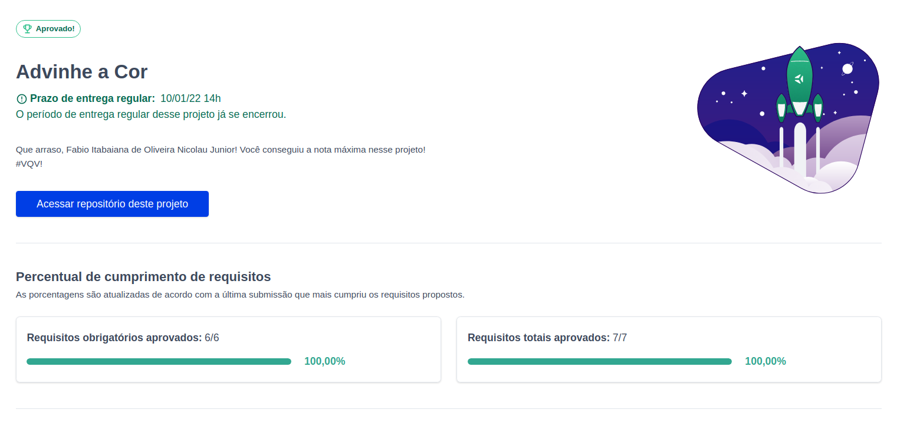

<h1>Sobre</h1>

Projeto bônus do módulo 1 - Fundamentos, da <a href="https://betrybe.com" target="_blank">Trybe!</a>

O desafio foi construir uma aplicação um número rgb e o usuário deve adivinhar qual cor é.

<h1>Aplicação pronta</h1>

<h1>Tecnologias utilizadas</h1>
<ul>
  <li>HTML</li>
  <li>CSS</li>
  <li>JavaScript</li>
</ul>

<h1>Nota</h1>

